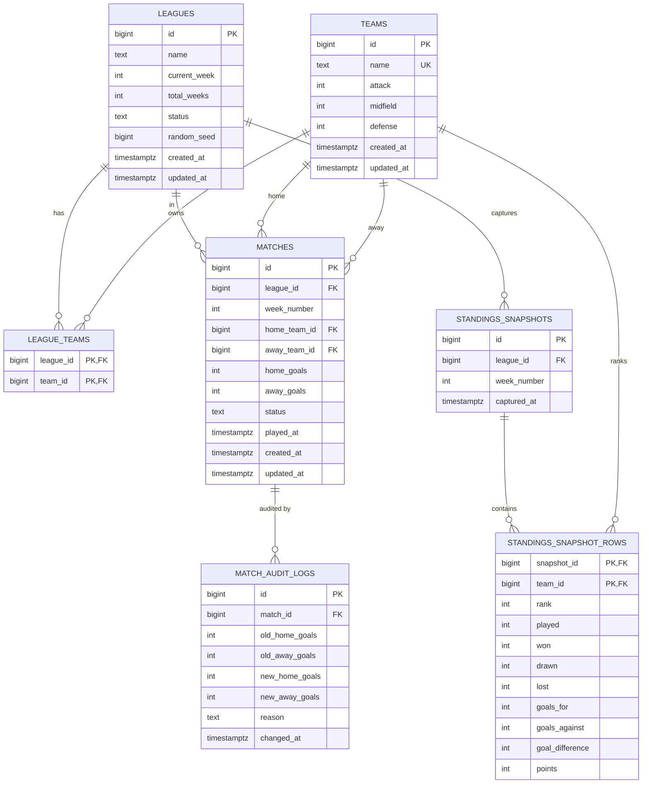

# Database Schema

The full schema lives in [`database/schema.sql`](../database/schema.sql) (the
deliverable copy) and is created by the migration in
[`database/migrations/`](../database/migrations/), applied automatically on
startup. This document is the visual + rationale companion.

Seven tables: a `leagues`/`teams` core, a `league_teams` join, the `matches`
fixtures, a `standings_snapshots` (+ rows) cache, and a `match_audit_logs`
trail.

---

## Entity-relationship diagram

---

## Tables

### `leagues`
One row per simulated competition. `status` ∈ `NOT_STARTED | IN_PROGRESS |
FINISHED` (CHECK-enforced); `current_week` starts at 0 and is `>= 0`;
`total_weeks` is `> 0` and equals `2·(teams − 1)`. `random_seed` makes the
whole season reproducible. A league owns its fixtures, snapshots, and audit
entries via `ON DELETE CASCADE`.

### `teams`
One row per club, with `name` **UNIQUE** and each rating `BETWEEN 1 AND 100`.
Teams exist independently of any league so the same club can be reused across
many leagues — this is the fixed pool that leagues are built from.

### `league_teams`
Many-to-many membership between leagues and teams. Composite PK
`(league_id, team_id)` blocks duplicate entries; a secondary index on
`team_id` supports reverse lookups. `league_id` cascades on league delete;
`team_id` does **not** cascade — deleting a league never removes catalog teams.

### `matches`
Every fixture in every league. Goal columns are `NULL` until played; `status` ∈
`SCHEDULED | PLAYED`. Key constraints:
- **`matches_played_goals_consistent`** — a `PLAYED` row must have both goals
  set, a `SCHEDULED` row must have neither. This keeps status and result from
  drifting apart, and lets the standings calculator trust `status` alone.
- **`matches_unique_fixture`** `(league_id, week_number, home_team_id,
  away_team_id)` — the generator never emits the same fixture twice.
- `CHECK (home_team_id <> away_team_id)` — no team plays itself.
- Index on `(league_id, week_number)` for week reads.

### `standings_snapshots` + `standings_snapshot_rows`
A per-week **cache** of the league table. `standings_snapshots` is one row per
league per week (`UNIQUE (league_id, week_number)`); `standings_snapshot_rows`
holds one ranked row per team (composite PK `(snapshot_id, team_id)`). `rank`
is 1-based and tie-breaks are applied *before* insertion, so stored order is
stable. This is derived state: it can always be rebuilt from `matches` (see the
`recalculate` endpoint), so nothing is lost if it is dropped.

### `match_audit_logs`
Append-only history of result edits: old and new goals plus an optional
`reason`. Never updated, only inserted, giving a full correction trail for
debugging and demos. Indexed by `match_id`.

---

## Design notes

- **Snapshots are a cache, not the source of truth.** The live table is always
  computed from `matches` (`StandingsCalculator`); snapshots exist to serve
  per-week history cheaply and are rebuildable — hence the `recalculate`
  endpoint and the `ON DELETE CASCADE` from `standings_snapshots` to its rows.
- **Cascade boundary.** Deleting a `leagues` row cascades to `league_teams`,
  `matches`, `standings_snapshots` (→ `standings_snapshot_rows`), and
  `match_audit_logs` (via `matches`), wiping a league atomically. The shared
  `teams` catalog is deliberately outside this boundary.
- **Audit immutability.** `match_audit_logs` is the only deliberately
  append-only table; everything else is mutable derived or live state.
- **Reuse via the join.** `league_teams` is what lets one team belong to many
  leagues without duplicating its ratings.

See [DESIGN §6](DESIGN.md) for the inline DDL and
[PREDICTION_ALGORITHM.md](PREDICTION_ALGORITHM.md) for how `matches` and team
ratings drive the simulation.
